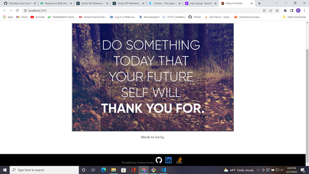
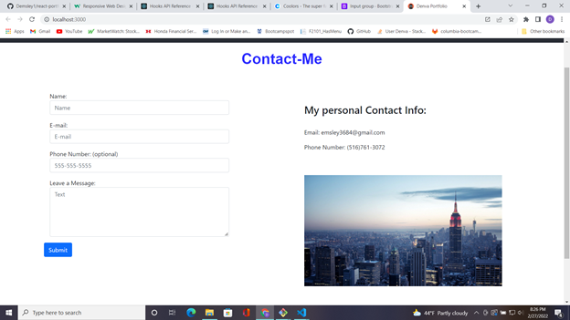
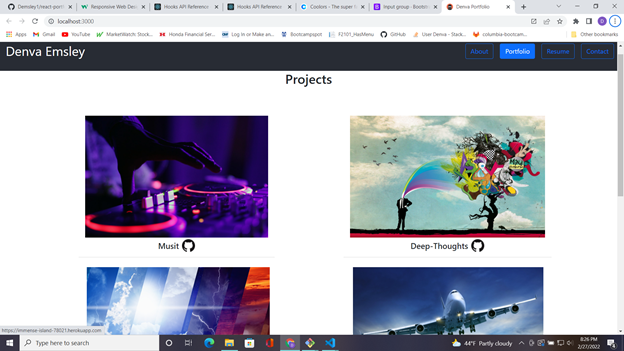

# React-Portfolio 
  ## Description 

  This is my portfolio I created with columbie engineering boot camp using the create react app. As it is a react app the portfolio is a single page application that changes displays throuh simple dom manipulation. The create react app provides a fairly easy to navigate template with custom methods tat allow handling of different navigational elements a little less painful, which we could all use in the world of web development.

  ## *Installation*

  This app is hosted live at my github page. You can also get the projetc files form the linked repository here: - [Portfolio](https://github.com/Demsley1/react-portfolio)

  ## Screenshots/Link

  - 
  - 
  - 

  -Live Page: [Portfolio](http://Demsley1.github.io/react-portfolio)

  ## Questions 

  - My GitHub username: Demsley1
  - Link to my GitHub page and repositories: [Github Link](https://github.com/Demsley1)
  _Link to my main work email if anyone should ever choose to contact me regarding work, or with helpful suggestions on how to improve this project and 
  also fix or update any major issues with project_
  - For All inquires email me at: emsley3684@gmail.com
